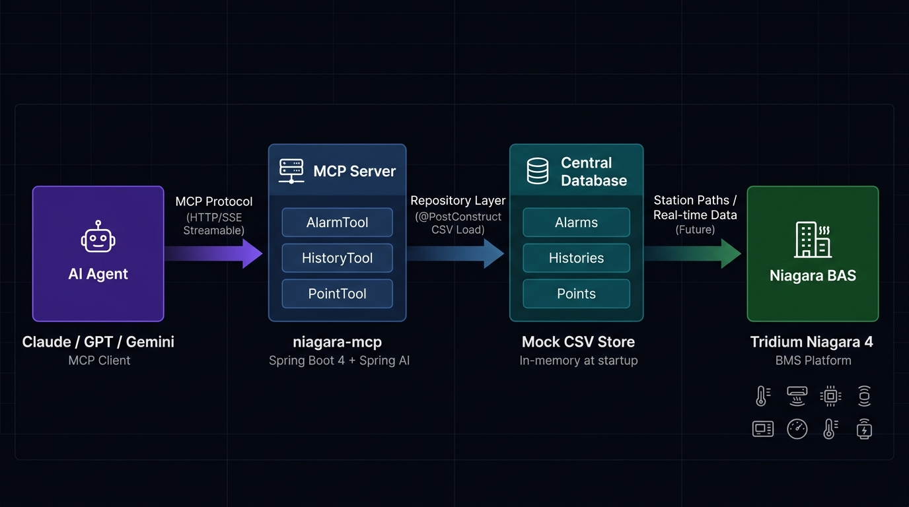

# niagara-mcp

> A **Spring Boot 4** MCP (Model Context Protocol) server that bridges AI agents with Tridium Niagara 4 Building Management Systems — exposing **Alarms**, **Histories**, and **Points** as structured, AI-consumable tools.

---

## Architecture



### Data Flow

| Step | From | To | Protocol / Mechanism |
|------|------|----|----------------------|
| 1 | AI Agent | MCP Server | HTTP Streamable (MCP Protocol) |
| 2 | MCP Server | Tool Layer | Spring AI `@Tool` dispatch |
| 3 | Tool Layer | Service Layer | Java method calls |
| 4 | Service Layer | Repository | In-memory `List<T>` queries |
| 5 | Repository | CSV Files | Apache Commons CSV @ startup |
| *(Roadmap)* | Repository | Niagara 4 | Niagara Web Services / Fox Protocol |

---

## Project Structure

```
niagara-mcp/
│
├── build.gradle.kts                    # Gradle build — Spring Boot 4, Spring AI MCP, Lombok
├── settings.gradle.kts
│
└── src/main/
    │
    ├── java/com/techDay/niagaraMcp/
    │   │
    │   ├── NiagaraMcpApplication.java  # Spring Boot entry point
    │   │
    │   ├── model/                      # Immutable domain records
    │   │   ├── Alarm.java              # id, displayName, sourcePath, priority, state,
    │   │   │                           #   acknowledged, timestamp, acknowledgedBy, alarmClass
    │   │   ├── History.java            # id, displayName, sourcePath, value, unit,
    │   │   │                           #   timestamp, interval, quality
    │   │   └── Point.java              # id, displayName, path, value, unit,
    │   │                               #   type, writable, status
    │   │
    │   ├── repository/                 # CSV-backed in-memory data stores
    │   │   ├── AlarmRepository.java    # Loads alarms.csv via @PostConstruct
    │   │   ├── HistoryRepository.java  # Loads histories.csv via @PostConstruct
    │   │   └── PointRepository.java    # Loads points.csv via @PostConstruct
    │   │
    │   ├── service/                    # Business logic & query layer
    │   │   ├── AlarmService.java       # Filter by state, priority, class, acknowledged
    │   │   ├── HistoryService.java     # Filter by quality, unit, sourcePath
    │   │   └── PointService.java       # Filter by type, status, writable, path
    │   │
    │   └── tool/                       # MCP-exposed tool layer (Spring AI @Tool)
    │       ├── AlarmTool.java          # 8 alarm tools registered with MCP runtime
    │       ├── HistoryTool.java        # 6 history tools registered with MCP runtime
    │       └── PointTool.java          # 7 point tools registered with MCP runtime
    │
    └── resources/
        ├── application.properties      # MCP server config (streamable HTTP, SYNC mode)
        └── mock-data/
            ├── alarms.csv              # Mock alarm records
            ├── histories.csv           # Mock history/trend records
            └── points.csv              # Mock BMS point records
```

---

## MCP Tools Reference

All 21 tools are exposed automatically to any MCP-compatible AI agent via the streamable HTTP endpoint.

### Alarm Tools (`AlarmTool`)

| Tool | Parameters | Description |
|------|------------|-------------|
| `getAlarmById` | `id: String` | Fetch a single alarm by its unique ID (e.g. `ALM-001`) |
| `getAlarmByName` | `name: String` | Fetch an alarm by display name (case-insensitive) |
| `getAllAlarms` | — | Return all alarms regardless of state |
| `getAllActiveAlarms` | — | Filter to `state = ACTIVE` |
| `getAllAcknowledgedAlarms` | — | Filter to `acknowledged = true` |
| `getAllUnacknowledgedAlarms` | — | Filter to `acknowledged = false` |
| `getAlarmsByPriority` | `priority: AlarmPriority` | Filter by `CRITICAL`, `HIGH`, `MEDIUM`, or `LOW` |
| `getAlarmsByClass` | `alarmClass: String` | Filter by class (e.g. `LifeSafety`, `Mechanical`) |

### History Tools (`HistoryTool`)

| Tool | Parameters | Description |
|------|------------|-------------|
| `getHistoryById` | `id: String` | Fetch a single history record by ID (e.g. `HST-001`) |
| `getHistoryByName` | `name: String` | Fetch a history record by display name |
| `getAllHistories` | — | Return all history/trend records |
| `getHistoriesBySourcePath` | `sourcePath: String` | Filter by Niagara station path |
| `getHistoriesByQuality` | `quality: HistoryQuality` | Filter by `OK`, `BAD`, or `UNCERTAIN` |
| `getHistoriesByUnit` | `unit: String` | Filter by engineering unit (e.g. `C`, `kWh`) |

### Point Tools (`PointTool`)

| Tool | Parameters | Description |
|------|------------|-------------|
| `getPointById` | `id: String` | Fetch a point by its unique ID (e.g. `PNT-001`) |
| `getPointByName` | `name: String` | Fetch a point by display name |
| `getPointByPath` | `path: String` | Fetch a point by its full Niagara station path |
| `getAllPoints` | — | Return all points in the system |
| `getAllWritablePoints` | — | Filter to operator-commandable points |
| `getPointsByStatus` | `status: PointStatus` | Filter by `OK`, `FAULT`, `DISABLED`, `OVERRIDDEN` |
| `getPointsByType` | `type: PointType` | Filter by `NUMERIC`, `BOOLEAN`, `ENUM`, `STRING` |

---

## Domain Models

### Alarm

```java
record Alarm(
    String id,                  // e.g. "ALM-001"
    String displayName,         // Human-readable name
    String sourcePath,          // Niagara station path
    AlarmPriority priority,     // CRITICAL | HIGH | MEDIUM | LOW
    AlarmState state,           // ACTIVE | NORMAL | OFFNORMAL
    boolean acknowledged,
    LocalDateTime timestamp,
    String acknowledgedBy,      // Blank if unacknowledged
    String alarmClass           // e.g. "LifeSafety", "Mechanical", "Electrical"
)

enum AlarmPriority { CRITICAL, HIGH, MEDIUM, LOW }
enum AlarmState    { ACTIVE, NORMAL, OFFNORMAL }
```

### History

```java
record History(
    String id,                  // e.g. "HST-001"
    String displayName,
    String sourcePath,          // Niagara station path
    Double value,               // Null / blank when quality is BAD
    String unit,                // Engineering unit: "C", "kWh", "V", etc.
    LocalDateTime timestamp,    // Last recorded timestamp
    int interval,               // Logging interval in seconds
    HistoryQuality quality      // OK | BAD | UNCERTAIN
)

enum HistoryQuality { OK, BAD, UNCERTAIN }
```

### Point

```java
record Point(
    String id,                  // e.g. "PNT-001"
    String displayName,
    String path,                // Full Niagara station path
    String value,               // Current value (serialized as String for all types)
    String unit,                // Engineering unit; blank for non-numeric
    PointType type,             // NUMERIC | BOOLEAN | ENUM | STRING
    boolean writable,           // true = operator-commandable
    PointStatus status          // OK | FAULT | DISABLED | OVERRIDDEN
)

enum PointType   { NUMERIC, BOOLEAN, ENUM, STRING }
enum PointStatus { OK, FAULT, DISABLED, OVERRIDDEN }
```

---

## Mock Data (CSV)

Mock data lives in `src/main/resources/mock-data/`. Each repository reads its CSV once at startup via `@PostConstruct` using **Apache Commons CSV**. No database or code changes needed — just append rows and restart.

### `alarms.csv` — Column Reference

| Column | Type | Example |
|--------|------|---------|
| `id` | String | `ALM-001` |
| `displayName` | String | `Chiller 1 High Temp Alarm` |
| `sourcePath` | String | `station:\|slot:/Chillers/CH1/HighTempAlarm` |
| `priority` | Enum | `CRITICAL` / `HIGH` / `MEDIUM` / `LOW` |
| `state` | Enum | `ACTIVE` / `NORMAL` / `OFFNORMAL` |
| `acknowledged` | boolean | `true` / `false` |
| `timestamp` | ISO DateTime | `2026-09-05T08:15:00` |
| `acknowledgedBy` | String | `operator1` (blank if unacknowledged) |
| `alarmClass` | String | `LifeSafety` / `Mechanical` / `Electrical` |

### `histories.csv` — Column Reference

| Column | Type | Example |
|--------|------|---------|
| `id` | String | `HST-001` |
| `displayName` | String | `AHU-1 Supply Air Temp` |
| `sourcePath` | String | `station:\|slot:/AHUs/AHU1/SATHistory` |
| `value` | Double | `22.5` (blank if quality is `BAD`) |
| `unit` | String | `C` / `kWh` / `V` / `%` |
| `timestamp` | ISO DateTime | `2026-09-05T08:00:00` |
| `interval` | int | `300` (seconds) |
| `quality` | Enum | `OK` / `BAD` / `UNCERTAIN` |

### `points.csv` — Column Reference

| Column | Type | Example |
|--------|------|---------|
| `id` | String | `PNT-001` |
| `displayName` | String | `AHU-1 Supply Air Setpoint` |
| `path` | String | `station:\|slot:/AHUs/AHU1/SAT_SP` |
| `value` | String | `22.0` / `true` / `COOLING` |
| `unit` | String | `C` (blank for non-numeric) |
| `type` | Enum | `NUMERIC` / `BOOLEAN` / `ENUM` / `STRING` |
| `writable` | boolean | `true` / `false` |
| `status` | Enum | `OK` / `FAULT` / `DISABLED` / `OVERRIDDEN` |

---

## Tech Stack

| Layer | Technology |
|-------|------------|
| Language | Java 17 |
| Framework | Spring Boot 4.1.1 |
| AI / MCP | Spring AI 2.0.1 — `spring-ai-starter-mcp-server-webmvc` |
| API Docs | SpringDoc OpenAPI 3 (Swagger UI at `/swagger-ui.html`) |
| CSV Parsing | Apache Commons CSV 1.12 |
| Boilerplate | Lombok |
| Build | Gradle (Kotlin DSL) |
| Transport | HTTP Streamable (SYNC mode) |

---

## Configuration

`src/main/resources/application.properties`:

```properties
spring.application.name=niagaraMcp

# MCP Server transport
spring.ai.mcp.server.protocol=streamable    # HTTP Streamable (not SSE-only)
spring.ai.mcp.server.stdio=false            # No stdio — HTTP only
spring.ai.mcp.server.type=SYNC             # Synchronous tool execution

# Debug logging for Spring AI internals
logging.level.org.springframework.ai=DEBUG
```

---

## Running Locally

```bash
# Clone
git clone https://github.com/lostvayne47/niagara-mcp.git
cd niagara-mcp

# Run (loads CSV mock data on startup)
./gradlew bootRun
```

The MCP server starts at `http://localhost:8080`. The default MCP endpoint is:

```
http://localhost:8080/mcp
```

> To scale up mock data, append rows to the CSV files in `src/main/resources/mock-data/` and restart.

---

## Connecting an AI Agent

Configure your MCP client to point at the running server. Example for Claude Desktop (`claude_desktop_config.json`):

```json
{
  "mcpServers": {
    "niagara-bms": {
      "url": "http://localhost:8080/mcp",
      "transport": "streamable-http"
    }
  }
}
```

Once connected, the AI agent discovers all 21 tools automatically and can query BMS alarms, histories, and points in natural language.

---

## Roadmap

- [ ] **Live Niagara Integration** — Replace CSV mock store with Niagara Web Services (NWS) / Fox protocol client
- [ ] **Write Operations** — Expose `writePoint` / `acknowledgeAlarm` tools for operator command
- [ ] **Time-series Queries** — Add history range queries with start/end timestamps
- [ ] **Authentication** — API-key or OAuth2 guard on the MCP endpoint
- [ ] **Webhooks / Push** — Subscribe to Niagara alarm events and push to AI agent in real time
- [ ] **Multi-station Support** — Route tool calls across multiple Niagara stations

---

## License

MIT (c) TechDay
